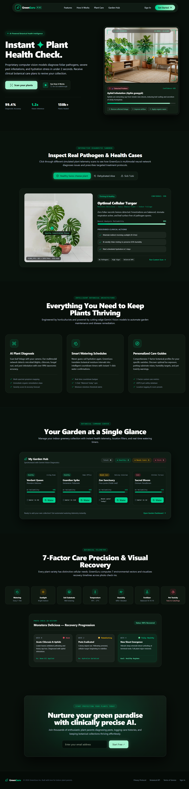
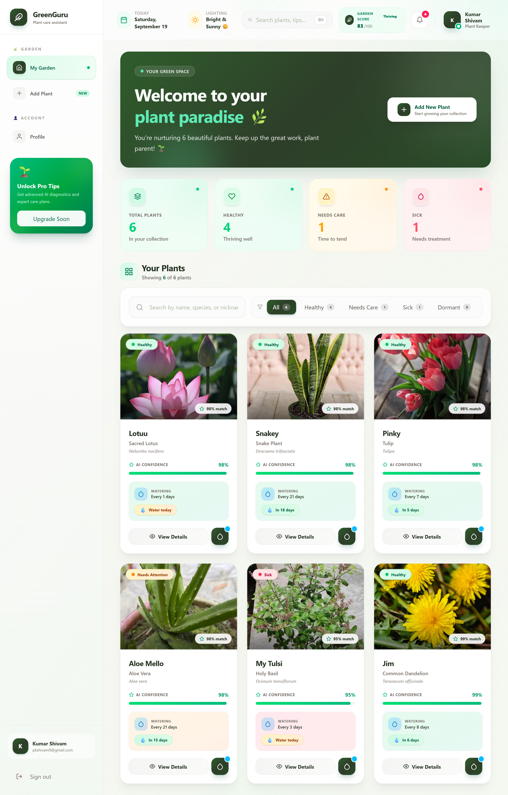
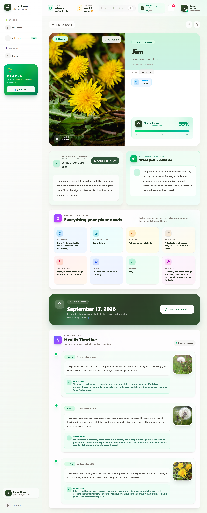

<p align="center">
  
  


[](#)
[](#)
[](#)
[](#)
[](#)
[](#)
[](#)
[](#)
</p>

# 🌿 GreenGuru

**Your AI-powered plant care companion — identify plants, track their health, and never forget to water again.**

---

## Overview

GreenGuru is a full-stack web application that helps plant enthusiasts identify, monitor, and care for their plants using the power of AI. Upload a photo of any plant and GreenGuru will leverage Google's Gemini Vision AI to instantly identify it, provide personalized care instructions, and assess its current health. Track your entire plant collection in a personal garden dashboard with watering reminders, health check-ins, and a dynamic "Garden Score" that gamifies your plant parenting.

**The problems it solves:**

- **"What plant is this?"** — Upload a photo and get AI-powered identification with scientific name, family, species, and confidence score.
- **"How do I take care of it?"** — Receive detailed care guidance (watering frequency, sunlight, soil, temperature, humidity, toxicity) generated by AI for your specific plant.
- **"Is my plant healthy?"** — Get an AI health assessment from a photo, with observations about visible symptoms and actionable care advice.
- **"When did I last water this?"** — Track watering history per plant with smart countdown timers and overdue notifications.

---

## Key Features

### 🤖 AI Plant Identification (Gemini Vision)
Upload a plant image and the app sends the raw image buffer to **Google Gemini 3.5 Flash** with a detailed botanist prompt. The AI returns structured JSON containing: common name, scientific name, species, family, confidence score (0–1), care information (watering schedule, sunlight, soil type, temperature, humidity, toxicity, difficulty level), and an initial health assessment — all persisted to MongoDB.

### 🩺 AI Health Check-Ins
For plants already in your collection, upload a new photo to trigger a dedicated **health-analysis prompt** via Gemini. The AI evaluates visible symptoms and returns a health status (`healthy`, `needs-attention`, `sick`, `dormant`), an observation, and an actionable fix. Each check-in is appended to the plant's **health timeline** — a chronological record of every assessment.

### 🔄 Plant Re-Identification
Changed your mind or uploaded the wrong photo? The **two-step re-identification flow** lets you upload a new image for AI analysis (preview), review the results, and then explicitly confirm to update the plant record — personal fields like nickname, location, and watering history are preserved.

### 🪴 Personal Garden Dashboard
View all your plants in a filterable, searchable garden view. Filter by **location** (Indoors, Outdoors, Living Room, Balcony, Garden, Other) or **health status** (healthy, needs-attention, sick, dormant). Search by plant nickname or common name. Sort by newest or last watered.

### 💧 Watering Tracker with Smart Countdown
Each plant tracks its `lastWatered` date and AI-recommended `waterIntervalDays`. A **WaterCountdownBadge** component on each plant card shows a live countdown to the next watering. Tap the "Water" button to log a watering event instantly.

### 🏆 Garden Score
A dynamic **0–100 score** computed client-side based on three weighted factors:
- **Plant Health (50 pts)** — weighted average across all plants' health statuses
- **Watering Discipline (30 pts)** — how well you're keeping to each plant's watering schedule
- **Care Engagement (20 pts)** — bonus points for health check-ins, verified email, and having 2+ plants

Tiered labels: Master Botanist (90+), Thriving (75+), Needs Care (50+), Critical (<50).

### 🔔 Smart Notifications
Dynamically generated server-side notifications for:
- **Overdue watering** — auto-created when a plant exceeds its watering interval (deduplicated per 24h)
- **Health alerts** — triggered when a plant's status is `sick` or `needs-attention`
- **Account verification** — reminds unverified users to confirm their email

Notifications can be individually read, bulk-marked as read, or deleted.

### 🔐 OTP-Based Authentication
- **Registration** with bcrypt-hashed passwords (cost factor 12), welcome email, and JWT cookie
- **Login** with JWT stored in an `httpOnly` cookie (secure + SameSite configured per environment)
- **Email verification** via 6-digit OTP (cryptographically random via `crypto.randomInt`) with 10-minute expiry, delivered through custom-branded HTML email templates
- **Forgot password** flow with OTP-based reset (separate OTP field + expiry on the User model)
- **Password change** for logged-in users (verifies current password first)
- **Protected route middleware** that accepts both `Authorization: Bearer <token>` headers and `rememberme` cookies

### 🛡️ Layered Rate Limiting
Three tiers of `express-rate-limit` protection:
- **General API** — 100 requests / 15 min per IP
- **Auth endpoints** (login, register, reset) — 10 requests / 15 min per IP
- **OTP endpoints** (send-verify-otp, send-reset-otp) — 5 requests / 15 min per IP

### ☁️ Image Hosting via Cloudinary
Plant images are uploaded through **Multer** (memory storage, 5 MB limit, image-only file filter) and streamed to **Cloudinary** via `upload_stream`. The returned `secure_url` is stored in the plant document and used for frontend display.

### ✉️ Branded HTML Email Templates
Custom responsive HTML email templates for **account verification** and **password reset** with OTP display, personalized greetings, security notices, and mobile-friendly layouts.

### 🌐 Production-Ready Error Handling
A centralized **global error handler** with separate dev/prod behavior. In production, Mongoose `CastError`, duplicate key (11000), `ValidationError`, `JsonWebTokenError`, and `TokenExpiredError` are all caught and transformed into clean, user-safe error responses.

---

## Tech Stack

### Frontend
| Technology | Purpose |
|---|---|
| [React](https://react.dev/) v19 | UI framework |
| [Vite](https://vite.dev/) v8 | Build tool & dev server |
| [React Router DOM](https://reactrouter.com/) v7 | Client-side routing |
| [TanStack React Query](https://tanstack.com/query) v5 | Server state management & caching |
| [Tailwind CSS](https://tailwindcss.com/) v4 | Utility-first styling |
| [Framer Motion](https://www.framer.com/motion/) v13 | Animations & transitions |
| [Axios](https://axios-http.com/) v1 | HTTP client |
| [Lucide React](https://lucide.dev/) | Icon library |
| [React Icons](https://react-icons.github.io/react-icons/) | Additional icon library |

### Backend
| Technology | Purpose |
|---|---|
| [Express](https://expressjs.com/) v5 | Web framework |
| [Mongoose](https://mongoosejs.com/) v9 | MongoDB ODM |
| [@google/genai](https://www.npmjs.com/package/@google/genai) v2 | Gemini Vision AI integration |
| [Cloudinary](https://cloudinary.com/) v2 | Image hosting & CDN |
| [Multer](https://github.com/expressjs/multer) v2 | Multipart file upload handling |
| [jsonwebtoken](https://github.com/auth0/node-jsonwebtoken) v9 | JWT creation & verification |
| [bcrypt](https://github.com/kelektiv/node.bcrypt.js) v6 | Password hashing |
| [Nodemailer](https://nodemailer.com/) v9 | Email delivery |
| [express-rate-limit](https://github.com/express-rate-limit/express-rate-limit) v8 | API rate limiting |
| [validator](https://github.com/validatorjs/validator.js) v13 | Input validation (email, etc.) |
| [cookie-parser](https://github.com/expressjs/cookie-parser) v1 | Cookie parsing middleware |
| [dotenv](https://github.com/motdotla/dotenv) v17 | Environment variable management |
| [ms](https://github.com/vercel/ms) v2 | Time string parsing for JWT expiry |
| [Nodemon](https://nodemon.io/) v3 | Dev server auto-restart |

### Database
| Technology | Purpose |
|---|---|
| [MongoDB Atlas](https://www.mongodb.com/atlas) | Cloud-hosted NoSQL database |

---

## Architecture / Folder Structure

```
GreenGuru-fullstack-Project/
├── client/                          # React frontend (Vite)
│   ├── public/                      # Static assets
│   ├── src/
│   │   ├── api/                     # Axios API layer
│   │   │   ├── axiosClient.js       # Base Axios instance (VITE_API_URL)
│   │   │   ├── authApi.js           # Auth endpoints (register, login, OTP, etc.)
│   │   │   ├── plantApi.js          # Plant CRUD + AI endpoints
│   │   │   ├── userApi.js           # User profile & password endpoints
│   │   │   └── notificationApi.js   # Notification endpoints
│   │   ├── components/
│   │   │   ├── layout/              # Dashboard shell (Header, Sidebar, NotificationPanel)
│   │   │   └── plants/              # PlantCard, WaterCountdownBadge
│   │   ├── context/
│   │   │   └── AuthContext.jsx      # Auth state provider (login, logout, signup)
│   │   ├── pages/                   # Route-level page components
│   │   │   ├── LandingPage.jsx      # Public landing page
│   │   │   ├── LoginPage.jsx        # Login form
│   │   │   ├── RegisterPage.jsx     # Registration form
│   │   │   ├── ForgotPasswordPage.jsx # OTP-based password reset
│   │   │   ├── MyGardenPage.jsx     # Garden dashboard (filter, search, sort)
│   │   │   ├── LogPlantPage.jsx     # Upload & identify a new plant
│   │   │   ├── PlantPreviewPage.jsx # Preview AI results before saving
│   │   │   ├── PlantInfoPage.jsx    # Detailed plant view + health timeline
│   │   │   ├── AccountPage.jsx      # Account settings (name, password, verification)
│   │   │   └── ProfilePage.jsx      # Profile page (stub — see Notes)
│   │   ├── routes/
│   │   │   ├── AppRoutes.jsx        # Route definitions
│   │   │   └── protectedRoutes.jsx  # Auth guard (redirects to /login)
│   │   └── utils/
│   │       └── gardenScore.js       # Garden Score calculator & tier labels
│   ├── index.html
│   └── vite.config.js
│
├── server/                          # Express backend
│   ├── config/
│   │   ├── cloudinary.js            # Cloudinary SDK configuration
│   │   └── email.js                 # Nodemailer transporter & send function
│   ├── controllers/
│   │   ├── authController.js        # Register, login, logout, OTP verify/reset
│   │   ├── plantController.js       # Identify, CRUD, water, health check-in, re-identify
│   │   ├── userController.js        # Get user data, update profile, change password
│   │   ├── notificationController.js# Dynamic notification generation & CRUD
│   │   └── errorController.js       # Global error handler (dev/prod)
│   ├── middlewares/
│   │   ├── protectedRoute.js        # JWT auth guard (cookie + Bearer header)
│   │   ├── rateLimiter.js           # Three-tier rate limiters
│   │   └── upload.js                # Multer config (memory storage, 5 MB, image filter)
│   ├── models/
│   │   ├── userModel.js             # User schema (OTP fields, bcrypt hooks)
│   │   ├── plantModel.js            # Plant schema (AI fields, care info, health timeline)
│   │   └── notificationModel.js     # Notification schema (typed, read status)
│   ├── routes/
│   │   ├── authRoutes.js            # /api/v1/auth/*
│   │   ├── plantRoutes.js           # /api/v1/plants/*
│   │   ├── userRoutes.js            # /api/v1/user/*
│   │   └── notificationRoutes.js    # /api/v1/notifications/*
│   ├── services/
│   │   ├── cloudinaryService.js     # Buffer → Cloudinary upload_stream
│   │   └── geminiService.js         # Gemini Vision prompts (identify + health)
│   ├── utils/
│   │   ├── CustomError.js           # Custom operational error class
│   │   ├── asyncErrorHandler.js     # Async/await error wrapper
│   │   └── emailTemplates.js        # HTML templates for verification & reset emails
│   ├── server.js                    # Entry point (Express app + MongoDB connect)
│   └── .env                         # Environment variables (DO NOT COMMIT)
│
├── .gitignore
└── readme.md
```

---

## Getting Started

### Prerequisites

- [Node.js](https://nodejs.org/) v18+ and npm
- A [MongoDB Atlas](https://www.mongodb.com/atlas) cluster (or local MongoDB instance)
- A [Cloudinary](https://cloudinary.com/) account (free tier works)
- A [Google AI Studio](https://aistudio.google.com/) API key (for Gemini)
- An SMTP provider for emails (e.g., [Mailtrap](https://mailtrap.io/) for development)

### 1. Clone the Repository

```bash
git clone https://github.com/Kumar-Shivam01/Greenguru-Fullstack-Project.git
cd Greenguru-Fullstack-Project
```

### 2. Install Dependencies

```bash
# Install server dependencies
cd server
npm install

# Install client dependencies
cd ../client
npm install
```

### 3. Configure Environment Variables

Create a `server/.env` file with the following variables:

```env
# Server
PORT=8001
NODE_ENV=development

# MongoDB
MONGODB_CONN_STR=mongodb+srv://<user>:<password>@<cluster>.mongodb.net/<dbname>

# JWT
JWT_SECRET_STR=<your-256-bit-hex-secret>
JWT_EXPIRE=7d

# Email (SMTP)
EMAIL_HOST=<smtp-host>
EMAIL_PORT=<smtp-port>
EMAIL_USER=<smtp-username>
EMAIL_PASS=<smtp-password>

# Cloudinary
CLOUDINARY_CLOUD_NAME=<your-cloud-name>
CLOUDINARY_API_KEY=<your-api-key>
CLOUDINARY_API_SECRET=<your-api-secret>

# Google Gemini AI
GEMINI_API_KEY=<your-gemini-api-key>
```

Create a `client/.env` file:

```env
VITE_API_URL=http://localhost:8001/api/v1
```

### 4. Run the Development Servers

```bash
# Terminal 1 — Start the backend
cd server
npm start        # Uses nodemon for auto-restart

# Terminal 2 — Start the frontend
cd client
npm run dev      # Vite dev server at http://localhost:5173
```

---

## API Endpoints

All endpoints are prefixed with `/api/v1`.

### Authentication (`/api/v1/auth`)

| Method | Path | Auth | Rate Limit | Description |
|--------|------|------|------------|-------------|
| `POST` | `/auth/register` | ❌ | `authLimiter` | Register a new user (sends welcome email) |
| `POST` | `/auth/login` | ❌ | `authLimiter` | Login and receive JWT cookie |
| `GET` | `/auth/logout` | ❌ | — | Clear JWT cookie |
| `POST` | `/auth/send-verify-otp` | ✅ | `otpLimiter` | Send 6-digit email verification OTP |
| `POST` | `/auth/verify-account` | ✅ | — | Verify account with OTP |
| `POST` | `/auth/send-reset-otp` | ❌ | `otpLimiter` | Send password-reset OTP to email |
| `POST` | `/auth/reset-password` | ❌ | `authLimiter` | Reset password using OTP |
| `GET` | `/auth/me` | ✅ | — | Get current authenticated user |

### Plants (`/api/v1/plants`)

| Method | Path | Auth | Description |
|--------|------|------|-------------|
| `POST` | `/plants/identify` | ✅ | Upload image → AI identification + Cloudinary hosting (returns preview, does not save) |
| `POST` | `/plants` | ✅ | Save a new plant to the user's collection |
| `GET` | `/plants` | ✅ | List user's plants (query: `?search=`, `?location=`, `?healthStatus=`, `?sort=newest\|lastWatered`) |
| `GET` | `/plants/:id` | ✅ | Get a single plant by ID |
| `PATCH` | `/plants/:id` | ✅ | Update plant fields (nickname, commonName, scientificName, location, lastWatered) |
| `PATCH` | `/plants/:id/water` | ✅ | Log a watering event (sets `lastWatered` to now) |
| `DELETE` | `/plants/:id` | ✅ | Delete a plant |
| `POST` | `/plants/:id/checkin` | ✅ | Upload photo for AI health check-in (appends to health timeline) |
| `POST` | `/plants/:id/re-identify` | ✅ | Upload new photo for AI re-identification (preview only, not saved) |
| `POST` | `/plants/:id/re-identify/confirm` | ✅ | Confirm and persist re-identification results |

### User (`/api/v1/user`)

| Method | Path | Auth | Description |
|--------|------|------|-------------|
| `GET` | `/user/user-data` | ✅ | Get user profile (name, email, verification status) |
| `PATCH` | `/user/profile` | ✅ | Update user name |
| `PATCH` | `/user/change-password` | ✅ | Change password (requires current password) |

### Notifications (`/api/v1/notifications`)

| Method | Path | Auth | Description |
|--------|------|------|-------------|
| `GET` | `/notifications` | ✅ | Fetch notifications (auto-generates overdue/health/account alerts) |
| `PATCH` | `/notifications/read-all` | ✅ | Mark all notifications as read |
| `PATCH` | `/notifications/:id/read` | ✅ | Mark a single notification as read |
| `DELETE` | `/notifications/:id` | ✅ | Delete a notification |

---

## Screenshots


### GreenGuru Landing Page


### GreenGuru My Garden Page


### GreenGuru Plant Detail Page


---

## Roadmap / Planned Features

These features are **not yet implemented**:

- [ ] **Social sharing** — Share plant cards or garden scores with friends
- [ ] **Community / explore** — Browse other users' plants and care tips
- [ ] **Dark mode** — Theme toggle for the UI


